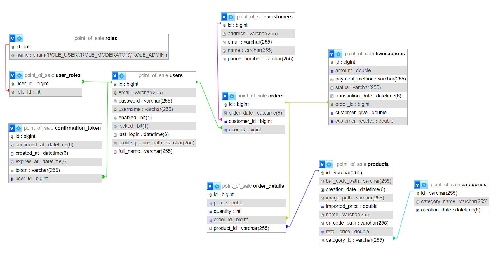
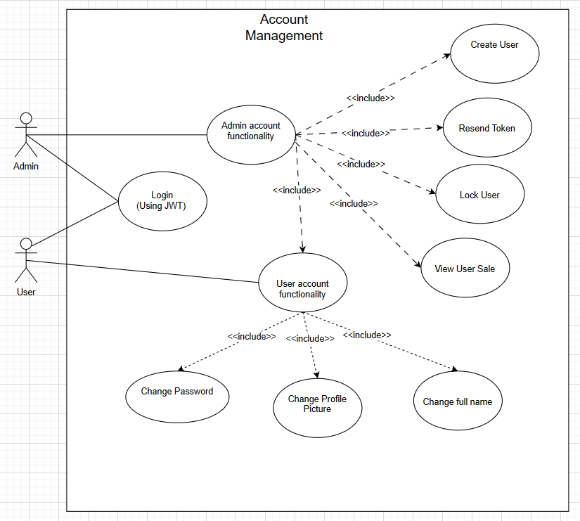
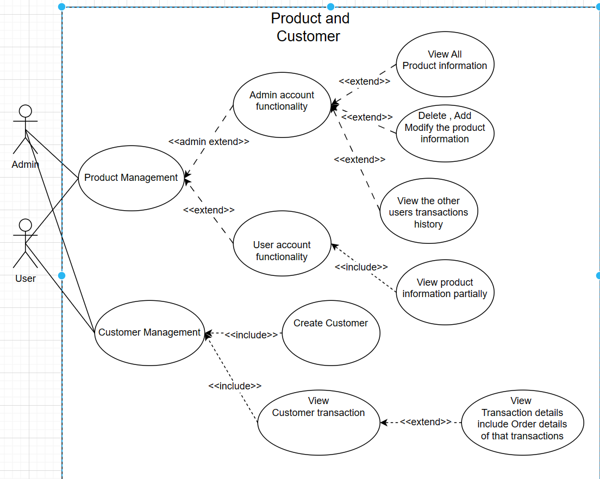
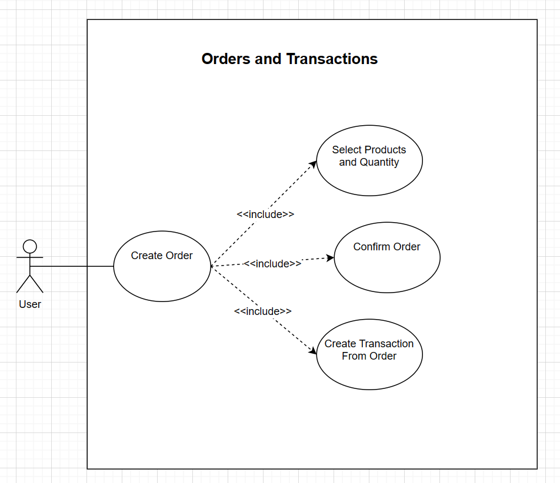

# Java Technology Final Project (POS)

## Using React For Fronted And Spring Boot API For Backend


### Username/password : admin/admin
### username/password : lovecraftmad08/nhutanh123
## Demo Youtube Link & Deployment Link
* [Youtube](https://www.youtube.com/watch?v=Kic3_mc6iDU)
* [Deployment](https://java-pos.onrender.com/) It takes times to load all the JavaScript. Please wait around 4-6 minutes
## Models Design

### Account Management 

### Product and Customer management

### Product and Customer management

// For connecting the database in Server
```bash
docker run -e DB_URL=jdbc:mysql://roundhouse.proxy.rlwy.net:49249/point_of_sale \
           -e DB_USERNAME=root \
           -e DB_PASSWORD=Ea-G4dC6baf3e3HFFHfF-cH6bdAEA3Gb \
           -e SERVER_PORT=8080 \
           -e SPRING_PROFILE=docker \
           your_image_name
```
```yaml
version: '3'
services:
  your-service:
    image: your_image_name
    environment:
      DB_URL: "jdbc:mysql://roundhouse.proxy.rlwy.net:49249/point_of_sale"
      DB_USERNAME: "root"
      DB_PASSWORD: "Ea-G4dC6baf3e3HFFHfF-cH6bdAEA3Gb"
      SERVER_PORT: 8080
      SPRING_PROFILE: "docker"
```
For connect the database in local
```properties
spring.datasource.url=jdbc:mysql://mysqldb:3306/point_of_sale
spring.datasource.username=root
spring.datasource.password=root

```